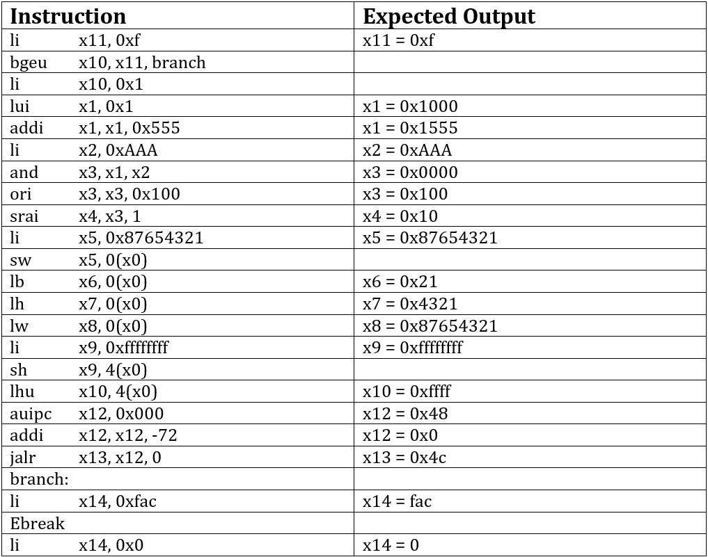
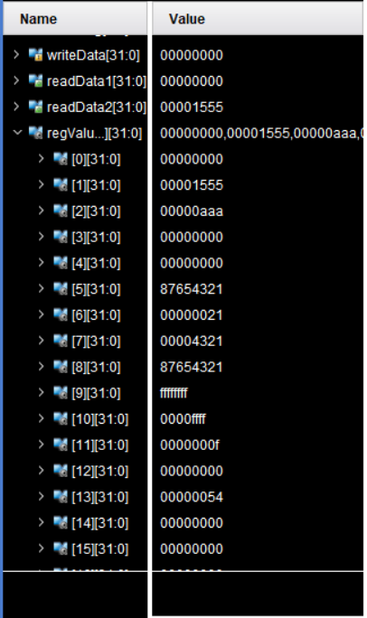
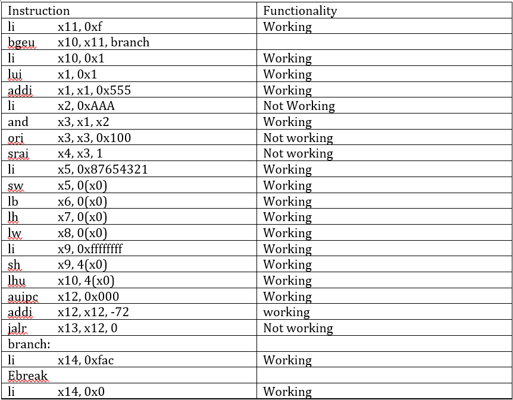

# RISCV-verilog
Implementation and simulation of RISC-V processor using Xilinx Vivado.

## Abstract
This project requirement is to design RISC-V processor that supports RV32I base integer instruction set. We were instructed to implement all 47 instructions of the RV321 set except ECALL, FENCE, FENCE.I, CSR using Verilog language. The first milestone of this project was to implement a simple Single Cycle processor with CPI =1. The second milestone was to add 5 pipeline register to make the processor pipeline and handle any hazards that may arise from pipelining, so we modified the single cycle processor to meet the new requirements, then we added a forward unite and hazard detection unite to handle data hazards with minimum wasted cycle. The final step of milestone two was to replace the instruction memory and data memory with Single memory that contains both. All kinds of memories created in this project had to be byte addressable. The data path of this processor consists mainly of program counter, single memory, register file, immediate generator, Control unite, ALU control unite, ALU unite and several multiplexers that control the inputs of several unites and two adders. The single memory was designed to accommodate instruction which were stored starting from the smallest index and data which was store in the largest index. A forwarding unite that controls 2 multiplexers connected to the two inputs of the ALU. The forwarding unites detected the need to forward either the output of the ALU or the read data from the memory and controlled the two multiplexers to forward them. The hazard detection unite was designed to detect load word hazard and stall the processor one cycle if it happened. In addition, a branching unite was implemented to flush the registers and branch in case of any jumping instruction. This was tested and simulated on Verilog and the expected output was found.

## Final Pipelined Data Path:

## Milestones: 
I.	Milestone 2:
In this milestone, we used some of the modules we implemented in the lab and modified them to implement the single cycle processor that can support RV32 wanted instructions.

•	Modified the data memory and instruction memory to be word addressable.

•	new multiplexers were added to accommodate instructions like AUIPC, JAL and JALR instructions.

•	The ALU module was modified to do the all the required shifting operations (SRL, SRA, SLL).

II.	Milestone 3:
We started this milestone by upgrading the single cycle processor to be pipelined. Forward unite, a hazard detection unite, and branching unite were also created handle hazards. 
•	The Forwarding Unit:
this unite compares the destination in the two previous instructions EXMEM rd and MEMWB rd to the sources of the current instruction and forward those destinations if needed to one of the ALU inputs.
•	Hazard Detection Unit:
This unite checks if a load word instruction has a destination that is the same as the instruction after it. In this case, we need to stall the CPU one cycle to have the correct read data from the memory.
•	Branching Unit:
This unite takes the opcode and function 3 of the instruction in addition to all the ALU flags and outputs one flag which controls the input of the PC and is also used to flush the pipeline register in case of a branch.
•	Single memory:
a)	The size of the single memory is 4kb and it was designed to be byte addressable.
b)	Sine this memory will hold both instructions and data.  An efficient design approach was to store the instruction starting from mem[0] which is the very first byte and store the data starting from the largest index. This division allowed a clear and easy accessing mechanism for both instructions and data.
c)	Since increasing the CPI to avoid load and store word hazard will decrease the performance of the processor, we decided to develop the hazard detection to deal with the new load, store word hazard.
d)	If a load word instruction is being performed, the hazard detection stalls the CPU for one clock cycle to avoid collisions with the instructions being fetched
e)	In case of a store word, we designed this memory to read and write at different clock edges to avoid collisions.  

III.	Milestone 4:
The aim of this milestone is to thoroughly test all the processor functionalities (47 instructions). We decided to take follow an easier, clearer and more applicable way to testing. This method is to write an assembly code in which the result of every instruction depends on the previous instruction. We then traced the code to know it’s output and compared it to the values we found in the registers to verify the correctness of the processor.   

## Testing:
In the single cycle processor, we tested our implementation using a pre-written instruction set that we loaded into the instruction memory. Since we expect an output after each clock cycle, we wrote a test bench that checks on the value of different wires in the data path to compare it with the expected value after each clock cycle.
However, in the pipelined data path, the testbench was only written to alternate the clock cycle and we could check the validity of performance by checking the final values in registers after the execution of the whole program at once. 

## Test program and expected output:

## Result:

## Validation:

## Conclusion:
The RISC-V processor functions correctly except with 4 instructions (li, ori, srai, jalr). It avoid data dependency hazards through the use of forwarding and stalling (in case of load-use hazards). It also functions well against structural hazards that could result from the single memory implementation because in case of memory access from two different instructions, a stall signal is produced and a bubble signal is resulted in this clock cycle. This stalling solution is used for control hazards as well. 

